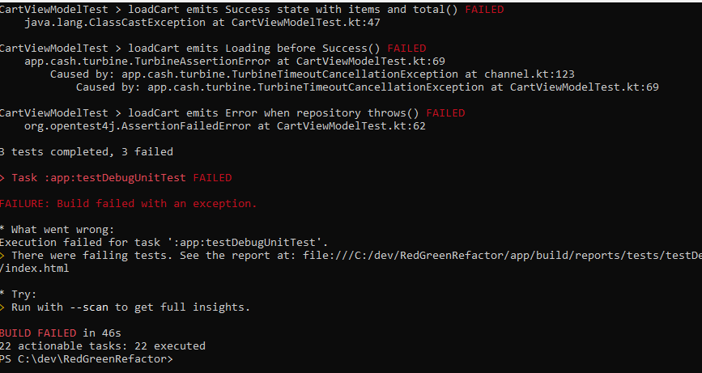
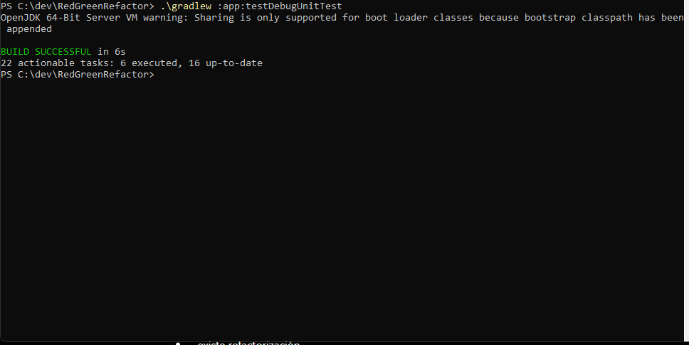

Red-Green-Refactor: TDD para ProductViewModel con MockK
Autor

Nombre: Dylan Garzón
Código: 02230131024
Programa: Ingeniería de Sistemas
Unidad: 9: Testing y Aseguramiento de Calidad en Móvil
Actividad: Post-Contenido 1
Fecha: 06/05/2026

Descripción del Proyecto

Este proyecto aplica el ciclo Red-Green-Refactor de TDD para construir un ProductViewModel en Android testeado desde el primer commit. Se utiliza MockK para aislar dependencias del repositorio y dispatcher, y se escriben pruebas que cubren escenarios de éxito, manejo de errores y estados de carga.

Objetivo

Aplicar el ciclo TDD (Test Driven Development) utilizando la estrategia Red → Green → Refactor para desarrollar un ProductViewModel en Android con Kotlin.

El proyecto implementa pruebas unitarias usando:

JUnit5
MockK
Turbine
kotlinx-coroutines-test

Además, se validan escenarios de:

carga correcta de productos
manejo de errores de red
transición de estados Loading → Success
Ciclo TDD Aplicado
RED

Se escribieron los tests antes de la implementación.
Al ejecutar las pruebas, estas fallaron, validando que el test detecta correctamente la ausencia de funcionalidad.

GREEN

Se realizó la implementación mínima necesaria en ProductViewModel para que todos los tests pasaran correctamente.

REFACTOR

Se mejoró el código utilizando runCatching, extrayendo lógica a funciones puras como calculateInventoryValue() y mejorando el manejo de errores, manteniendo todos los tests en verde.

Tecnologías Utilizadas
Kotlin 1.9.22: Lenguaje de programación
Android Studio Hedgehog: IDE
JUnit 5: Framework de pruebas unitarias
MockK 1.13.9: Librería de mocking
Kotlin Coroutines Test: Soporte para pruebas de corrutinas
Turbine 1.1.0: Librería para testear StateFlow
Gradle 8.7: Gestor de dependencias
Estructura del Proyecto
app/src/main/java/com/universidad/red_green_refactor/

├── domain/
│
│ ├── model/
│ │ └── Product.kt
│ │
│ └── repository/
│ └── ProductRepository.kt
│
└── ui/
    └── product/
        ├── ProductUiState.kt
        ├── ProductViewModel.kt
        └── AnalyticsService.kt

app/src/test/java/com/universidad/red_green_refactor/ui/product/

└── ProductViewModelTest.kt
Instrucciones de Ejecución
1. Clonar el repositorio
git clone https://github.com/dylandjg8413-gif/Garzon-post1_u9.git
cd Garzon-post1_u9
2. Ejecutar los tests desde la terminal

En PowerShell o terminal de Android Studio:

./gradlew :app:testDebugUnitTest
3. Verificar resultados

Al terminar la ejecución, se debe visualizar un mensaje similar a:

BUILD SUCCESSFUL in Xs
4 tests completed, 0 failed
Desarrollo usando TDD
Fase RED — Tests primero

En esta etapa se escribieron primero las pruebas antes de implementar ProductViewModel.

Se definieron:

contratos
modelos
estados UI
comportamiento esperado
Tests implementados
Success con valor total correcto

Verifica que:

se carguen los productos
el valor total del inventario sea calculado correctamente
@Test
fun loadProducts emits Success state with products and inventoryValue() = runTest
Error cuando el repositorio falla

Verifica que:

si ocurre una excepción (IOException)
el ViewModel emita un estado Error
@Test
fun loadProducts emits Error when repository throws() = runTest
Secuencia Loading → Success

Verifica que:

primero se emita Loading
luego Success
@Test
fun loadProducts emits Loading before Success() = runTest
Resultado del checkpoint RED

Se ejecutó:

./gradlew :app:testDebugUnitTest

Salida observada:

3 tests completed, 3 failed

Esto confirma correctamente la fase RED del ciclo TDD.

Fase GREEN — Implementación mínima

En esta etapa se implementó el código mínimo necesario para hacer pasar todos los tests.

Implementación realizada

Se creó:

ProductViewModel
manejo de estados
cálculo del valor del inventario
captura de errores

Se utilizó:

MutableStateFlow
viewModelScope
Coroutines
Resultado del checkpoint GREEN

Se ejecutó:

./gradlew :app:testDebugUnitTest

Resultado:

BUILD SUCCESSFUL

Todos los tests pasaron correctamente.

Fase REFACTOR — Mejora del código

Con los tests en verde, se realizó refactorización del código sin alterar el comportamiento validado.

Mejoras aplicadas
Extracción de calculateInventoryValue() como función pura
Manejo específico de IOException
Uso de runCatching
Código más limpio y mantenible
Test adicional agregado

Se agregó un test adicional para validar:

calculateInventoryValue(emptyList()) == 0.0

Esto permite validar correctamente casos límite.

CHECKPOINTS DE VERIFICACIÓN

Checkpoint 1 — Fase RED
Los tests se definieron con el contrato de las interfaces.
Fallaron inicialmente al no existir implementación en el ViewModel.
Commit
feat: Agrega tests RED para ProductViewModel (TDD paso 1)

Checkpoint 2 — Fase GREEN
Implementación mínima en ProductViewModel.loadProducts().
Todos los tests pasaron correctamente.
Commit
feat: Implementa ProductViewModel GREEN — todos los tests pasan (TDD paso 2)

Checkpoint 3 — Fase REFACTOR
Refactorización usando runCatching.
Extracción de función pura calculateInventoryValue().
Adición de test para lista vacía.
Commit
refactor: Refactoriza ProductViewModel (TDD paso 3)

## Capturas de Resultados

Las capturas se encuentran en la carpeta `/evidencias/`:

### Barra Roja en Android Studio

### Barra Verde en Android Studio

### Estado Refactor

